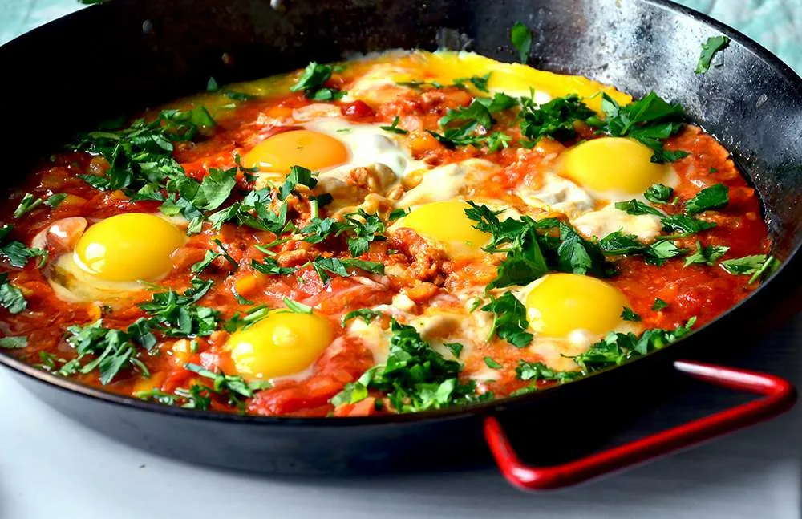

# Как добыть шакшуку

Шакшука - это яичница из Израиля. Она плавает в изумительном красном пряном соусе. Но как же добыть ее, не выходя из кухни?

## Вам понадобится:

* Лук - 1
* Специи (по полчайной ложки) - зира, кумин, соль
* Болгарский перец - 1
* Банка томатов в собственном соку
* Томатная паста - 1 ч.л.
* Яйца - 6 шт.
* Кинза

## Рецепт:
1. Обжарить лук до мягкости
2. Добавить специи и обжарить их, чтобы раскрыть вкус
3. Добавить томаты и перец, потушить 5 минут
4. Добавить томатную пасту, влить стакан воды, размешать до однородности
5. Тушить 10 минут (если вода выпарится - добавить ещё воды так, чтобы соус покрывал сковороду на 2-3 см)
6. Разбить яйца и влить в соус. Из соуса должны выглядывать только желтки.
7. Жарить не накрывая крышкой до готовности яйца
8. Подавать, посыпав кинзой с хрустящими тостами.

## Приятного аппетита!

